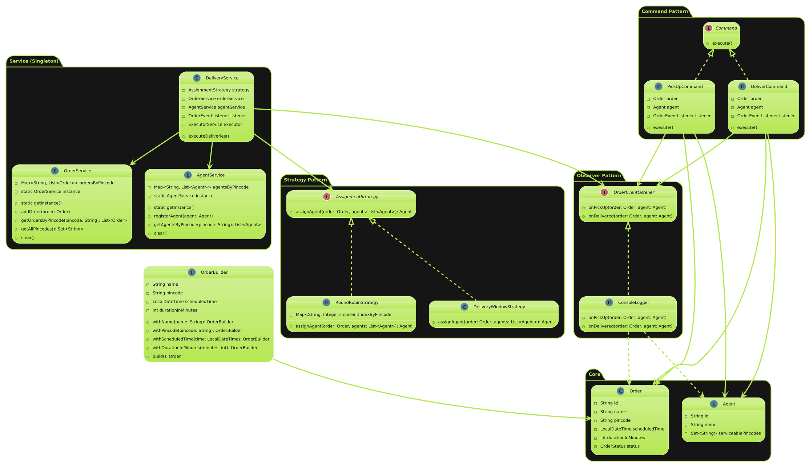

# 📦 Delivery Assignment System

This project is a simulation of a multi-threaded delivery assignment system where delivery agents are assigned to orders based on pincode and a chosen strategy (Round-Robin or Delivery-Window). It demonstrates clean architecture and decoupling using design patterns.

---

## 🚀 Functional Requirements

- Create and manage delivery orders with:
  - Name
  - Pincode
  - Scheduled delivery time
  - Duration
- Register delivery agents who serve one or multiple pincodes.
- Assign agents to orders based on a pluggable assignment strategy.
- Simulate the delivery life cycle: picked up → delivered.
- Log each step of the delivery using the observer pattern.
- Run deliveries per pincode concurrently using multithreading.

---

## ✨ Bonus Features

- Builder Pattern for object creation (Order, Agent).
- Strategy Pattern to support pluggable agent assignment strategies:
  - RoundRobinStrategy
  - DeliveryWindowStrategy
- Observer Pattern to log events (pickup, delivery).
- Command Pattern to encapsulate delivery commands.
- Singleton Pattern for services (OrderService, AgentService).
- Thread-safe concurrent execution per pincode.

---

## 🧠 High-Level Design (HLD)

### Components Overview

- **OrderService**: Manages orders grouped by pincode.
- **AgentService**: Manages agents grouped by pincode.
- **DeliveryService**: Coordinates agent assignment and simulates delivery.
- **AssignmentStrategy**: Strategy interface for agent selection.
- **OrderEventListener**: Observer interface for logging.
- **Commands**: Encapsulate delivery actions (`PickUpCommand`, `DeliverCommand`).

### Delivery Flow

1. Orders and agents are created via builders.
2. Registered into respective singleton services.
3. A delivery strategy is passed to the `DeliveryService`.
4. For each pincode:
    - A task is run in parallel to assign agents to each order.
    - Deliveries are executed in order: Picked → Delivered.
5. Logging is handled via observers.

---

## 🧩 Design Patterns Used

| Pattern            | Purpose                                                                 |
|--------------------|-------------------------------------------------------------------------|
| **Builder**        | Create complex `Order` and `Agent` objects with optional fields.        |
| **Singleton**      | Ensure one instance of services (`OrderService`, `AgentService`).       |
| **Strategy**       | Choose agent assignment logic at runtime.                              |
| **Observer**       | Decouple logging from delivery execution.                              |
| **Command**        | Encapsulate `pickUp()` and `deliver()` actions as commands.             |

---

## 📌 UML Class Diagram

This diagram illustrates all key classes and their relationships:

---

## ✅ How to Run

1. Clone this repo and open it in your favorite IDE.
2. Make sure you're using Java 16+ (or match the target version in your `pom.xml` or build.gradle).
3. Run the `Main.java` class inside the driver package.
4. You should see delivery logs on the console.

---

## 🧪 Test Scenarios

- Multiple orders in same and different pincodes.
- Vary agent coverage and see Round-Robin vs Delivery-Window assignment.
- Log includes all pickup and delivery actions.
- Add your own agents and orders in `Main.java` to test other cases.

---
## 👤 Author

GitHub: [vij-yant](https://github.com/vij-yant)

---

## 🛠️ Improvements to Consider

- Add persistence (database or in-memory cache).
- Implement UI or REST APIs with Spring Boot.
- Retry mechanism on delivery failure.
- Assign multiple agents per time slot to improve efficiency.

---

